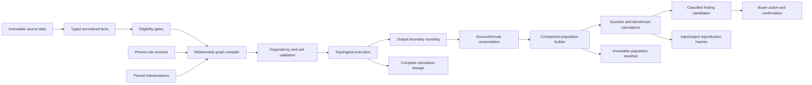
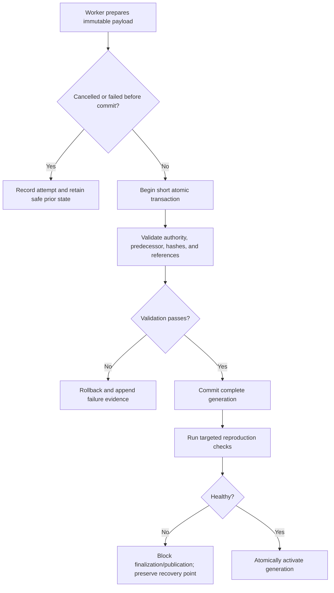

# Forge X computation and scalability design — September 11, 2026

Status: proposed design contract; no calculation engine is implemented by this document.

## 1. Computation objective

Forge X calculations must be deterministic, exact within approved decimal limits, explainable, independently reproducible, and unable to use evidence outside the pinned scenario and comparison population.

The engine operates on normalized typed facts and cost relationships after source evidence, interpretation, units, currency, roles, and analytical eligibility have been resolved.

## 2. Calculation pipeline



## 3. Typed value model

Every numerical value carries:

- exact submitted lexeme when source-derived;
- decimal coefficient and scale;
- normalized unit and submitted unit label;
- currency when monetary;
- measurement grain such as per part, assembly, vehicle, hour, cycle, meter, pound, year, or program;
- economic period or effective date where applicable;
- source, user input, knowledge, or derived provenance;
- precision and analytical-eligibility state.

Blank, zero, not applicable, missing, blocked, and unresolved are distinct states. Missing values never default to zero.

## 4. Precision and rounding

The approved foundation remains:

- preserve the full submitted lexeme;
- use base-10 arithmetic, never binary floating point for governing commercial calculations;
- retain full supported intermediate precision inside a defined calculation;
- round each governing calculation output to four decimal places;
- round midpoint values away from zero, aligned with Excel `ROUND` unless a separately approved rule says otherwise;
- apply two-decimal presentation only after retaining the four-decimal governing result;
- surface an explicit precision exception rather than truncating an unsupported value.

Each relationship declares its output boundary. The engine must not copy incidental workbook intermediate rounding into a Forge rule silently; differences remain part of formula reconciliation.

## 5. Relationship execution model

### 5.1 Compilation

The future compiler resolves relationship terms to typed inputs, validates allowed provenance, checks dimensions and units, resolves pinned knowledge, and constructs a directed acyclic graph. It records every rejected, missing, or ineligible dependency.

### 5.2 Execution

Relationships execute in topological order. Each output receives:

- exact calculated decimal;
- four-decimal governing representation where applicable;
- unit, currency, grain, and period;
- relationship and rule version;
- ordered lineage to every direct dependency;
- transitive evidence manifest hash;
- reconciliation classification and limitations.

### 5.3 Reproduction

A completed run is reproduced from its frozen scenario, registry/knowledge pins, evidence manifest, relationship manifests, rule/engine versions, and ordered outputs. Later evidence or rules create a new run; they do not change the earlier result.

## 6. Initial relationship library

These are normalized economic relationships derived from the three traces. Exact supplier formulas remain separate evidence.

### 6.1 Component operation

```text
run labor = labor rate × operators × cycle time ÷ pieces per cycle × quantity per assembly
setup labor = labor rate × operators × setup hours ÷ good pieces per batch × quantity per assembly
machine = machine rate × cycle time ÷ pieces per cycle × quantity per assembly + supported setup machine
conversion scrap = supported scrap factor × eligible conversion base
workshop added value = direct labor + machine + conversion scrap
```

Gates: positive cycle output, compatible hour/second conversion, explicit setup conditions, explicit scrap definition, and supported overhead/profit bases.

### 6.2 Component material

```text
base material = quantity × supported gross usage × unit price
transport/duty = supported usage basis × submitted adders
scrap = supported yield/scrap relationship
material overhead = confirmed overhead base × overhead rate
offal recovery = recoverable quantity × recovery rate
net material = base material + transport + duty + scrap + overhead - offal recovery
```

Gates: special-category treatment, gross/net unit compatibility, yield definition, transport/duty basis, overhead base, recovery ownership, and physical unit.

### 6.3 Annual plant allocation

```text
annual staffed cost = staffing × work pattern × rate
annual variable pool = sum(eligible variable cost relationships)
annual fixed pool = sum(eligible fixed cost relationships)
allocated amount = annual pool ÷ explicit denominator
amortized amount = approved financing/timing relationship ÷ approved volume basis
```

Gates: pool period, CPV/FPV/capacity classification, positive denominator, allocation grain, work pattern, amortization/payment treatment, and excluded cost categories.

### 6.4 Wiring material and labor

```text
metal weight = sum(part usage × metal intensity)
wire material = base conversion per length + metal weight × dated commodity rate
component material = quantity × base component price + embedded metal adjustment
direct labor = sum(standard minutes × activity quantity × skill rate) ÷ 60
indirect labor/burden = explicit eligible base × confirmed rate
```

Gates: exact wire/component specification, conductor, each/meter/gram basis, skill-rate resolution, commodity date and geography, and linked-sheet lineage.

## 7. Eligibility gates

Eligibility is evaluated per analytical use.

| Gate | Commercial price | Cost structure | Formula reconciliation | Governing benchmark |
|---|---:|---:|---:|---:|
| Confirmed supplier/part/context | Required | Required | Required observation | Required |
| Final price present | Required | No | No | Measure-specific |
| Source role resolved | Required | Required | Required | Required supplier/market role |
| Unit/currency confirmed | Required | Required by measure | Required for amount variance | Required |
| Formula cache/parser supported | No if submitted price valid | Measure-specific | Required for governing reconciliation | Required if formula-derived measure governs |
| Detailed structure complete | No | Required by included fields | No | Required dimensions only |
| Economic date eligible | Required | Required | Context may remain | Required |
| Comparison basis confirmed | No | No | No | Required |

A valid commercial quote may remain in APV/NPV while detailed cost fields are blocked. The system must disclose the distinction.

## 8. Comparability computation

### 8.1 Candidate discovery

Start broad enough to explain exclusions, but never admit evidence merely because a label matches. Candidate selection pins source role, cutoff, commodity, measure, and minimum identity.

### 8.2 Dimension evaluation

Evaluate unit, currency, time, geography, plant, exact part/family permission, specification, process, equipment, volume, cost inclusions, allocation basis, commercial terms, and evidence reliability. Results are matched, mismatched, missing, transformed by approved rule, or not applicable.

### 8.3 Population freeze

Freeze included and excluded candidates, reasons, rules, mappings, weighting, and cutoff. Rebuilding with later information creates a new population version.

### 8.4 First populations

Proposed first populations, in order:

1. direct labor rate for the same economic year, region, plant scope, currency/hour unit, and confirmed inclusion basis;
2. machine rate for the same process/equipment signature, year, region, currency/hour unit, and burden inclusion basis;
3. wiring standard minutes for the same operation, activity unit, specification/process context, and comparable part scope;
4. material unit rate for the same specification, physical unit, geography/date, transport terms, and volume basis;
5. annual plant allocations only after pool definitions, work patterns, and denominators align.

## 9. Benchmark and statistical model boundary

Descriptive distributions may report count, independent-event count, minimum, maximum, median, robust spread, raw mean, and equal-event mean. Raw records and independent commercial events are separate measures.

Regression or other statistical models begin only after:

- population rules are approved and reproducible;
- unit, currency, basis, geography, economic date, and process/specification dimensions are reliable;
- duplicate and event weighting are controlled;
- sample size and missingness are disclosed;
- model specification, diagnostics, uncertainty, and intended use are versioned.

A residual or prediction gap is evidence for investigation, never a confirmed saving.

## 10. Finding computation

The finding engine consumes a calculation result plus its comparison population and lineage. It produces a candidate containing challenged fact/relationship, finding class, impact basis, confidence, uncertainty, missing evidence, and proposed action.

| Finding class | Minimum evidence | Permitted claim |
|---|---|---|
| Formula discrepancy | Source formula/value plus independently supported reconciliation | Formula does not reconcile under stated rule |
| Peer evidence difference | Comparable population and observed difference | Supplier differs from peers under stated conditions |
| Modeled opportunity | Approved scenario/model and complete assumptions | Potential modeled impact |
| Directional signal | Incomplete but relevant evidence with limitations | Investigation priority only |
| Confirmed commercial saving | Supported commercial decision, scope, volume/time basis, and audit evidence | Confirmed saving within the stated boundary |

## 11. Scalability envelope

The established acceptance-scale reference remains 250,000 PBD observations and 10 million operation/material detail rows. Scalability design must also accommodate hundreds of sourcing events, immutable versions, repeated analytical generations, and retained audit/publication history.

### 11.1 Workload classes

| Workload | Shape | Design response |
|---|---|---|
| Workbook ingestion | Bursty, XML-heavy, many cells/tabs | One-open extraction, streaming parse, bounded batches, resumable receipts |
| Mapping/review | Interactive, sparse writes | Indexed review queues and precomputed context |
| Relationship build | Many small graphs per observation | Batch compilation, content-hash reuse, deterministic graph manifests |
| Historical lookup | Supplier/part/plant/time scans | Composite indexes and keyset pagination |
| Population build | Filter/compare across many evidence rows | Narrow typed columns, prefiltered eligibility projections, immutable generations |
| Scenario calculation | Read-heavy graph execution | Pinned snapshots, set-based retrieval, in-memory bounded graph partitions |
| Dashboard/search | High-frequency reads | Rebuildable faceted/full-text projections |
| Publication/recovery | Large sequential I/O | Verified checkpoints, manifest streaming, retry-safe queue |

### 11.2 Data access strategy

- Query authoritative normalized tables for decisions and reproduction.
- Use generation-stamped projections for search, dashboards, supplier profiles, and common population candidates.
- Never use a projection as the only evidence copy.
- Use keyset rather than offset pagination for long timelines and search results.
- Fetch graph inputs in observation/scenario batches to avoid per-term queries.
- Store frequently queried dimensions in typed columns; use JSON only for immutable diagnostics or rarely queried payloads.

### 11.3 Index families

Indexes are driven by approved queries and benchmarked before release:

- observation by supplier, plant, part, event, economic date, and recorded cutoff;
- submitted measure by field/measure code, unit, currency, observation;
- material/operation classification by commodity, process, equipment signature, specification, region, and time;
- relationship terms by relationship, datum, output, and rule version;
- comparison members by context, evidence identity, inclusion state, and dimension status;
- findings/actions by event, supplier, part, class, state, owner, and time;
- audit/publication/checkpoint records by sequence and generation.

### 11.4 Concurrency

Use one commodity writer with short explicit transactions. Extraction and calculation workers prepare immutable payloads outside the write transaction, then atomically register complete results. Readers consume WAL snapshots or validated published snapshots. Leases recover abandoned background work without rewriting evidence.

### 11.5 Partitioning and growth

The initial local database remains one commodity workspace. Before physical partitioning is considered, benchmark:

- database size and page-cache behavior at acceptance scale;
- import and population-build write amplification;
- relationship-term and lineage growth;
- checkpoint duration and publication package size;
- restore and integrity-gate duration.

If limits are exceeded, partition by governed commodity workspace or immutable historical package generation—not by ad hoc supplier files. Cross-workspace manager reporting reads published summaries and drill-down packages rather than writing into buyer databases.

## 12. Proposed performance budgets

These are engineering targets for later approval, not current claims:

| Operation | Proposed target at acceptance scale |
|---|---:|
| Open supplier/part history view | p95 <= 2 seconds |
| Search/facet page after cache warm-up | p95 <= 1 second |
| Re-run a typical event analysis after ingestion | seconds to several minutes |
| Commit one completed extraction batch | <= 5 seconds of writer lock |
| Cancel long extraction/calculation | reach safe boundary <= 5 seconds |
| Health summary on normal open | p95 <= 5 seconds, with deep checks schedulable |
| Recovery status query | p95 <= 1 second |

Final targets require a representative hardware profile and workload definition.

## 13. Failure and recovery design



Every migration later requires full-chain dry run, existing-database checkpoint, transactional apply, post-migration health gate, and recorded execution evidence. Every publication requires a restorable checkpoint and remote hash verification.

## 14. Scalability validation plan

1. Generate non-private deterministic datasets at smoke, representative, and acceptance scales.
2. Validate exact expected results before measuring latency.
3. Capture p50, p95, maximum, row counts, file size, memory high-water mark, and query-plan fingerprints.
4. Test cold and warm cache behavior.
5. Test interrupted ingestion, worker expiry, cancellation, failed migration, unavailable source, offline publication, conflict, and restore.
6. Reproduce randomly sampled relationship graphs, populations, results, and findings independently.
7. Treat a correctness, lineage, privacy, or recovery failure as release-blocking even when latency passes.
