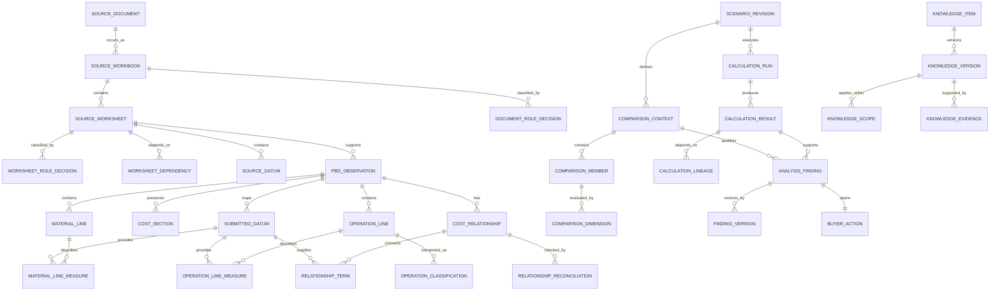
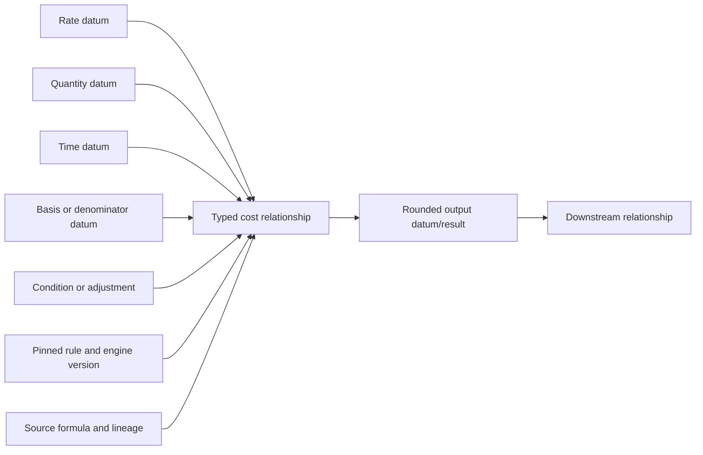

# Forge X cost-intelligence logical schema — September 11, 2026

Status: proposed logical design for review. Table names and physical storage are not implementation commitments.

## 1. Design rules

- Source evidence is immutable and never overwritten by interpretation.
- Submitted structure and normalized meaning coexist.
- A normalized fact always resolves to source evidence or an explicit user/rule input.
- Cost relationships store typed dependencies, not only formula text or a single rate/basis pair.
- Comparability is an immutable population decision with dimension-level reasons.
- Derived projections may be rebuilt; finalized analyses remain frozen.
- Current state is resolved from append-only decisions and supersession chains.
- No cross-unit, cross-currency, cross-period, or cross-basis comparison becomes governing without an approved transformation.
- Company-private evidence, shared knowledge, and central master data remain separately scoped.

## 2. Logical relationship map

## 3. Record classes

| Class | Meaning | Update rule |
|---|---|---|
| Evidence | What a source or user actually supplied | Append only; never corrected in place |
| Interpretation | What Forge or an authorized user says evidence means | Append new version; preserve predecessor |
| Relationship | How typed inputs produce outputs | Immutable per rule/source version |
| Decision | Role, eligibility, activation, comparability, or closure choice | Append-only decision chain |
| Derived result | Reproducible output tied to a population and engine/rule version | Immutable run; rebuild as new generation |
| Projection/cache | Performance-oriented read model | Atomically replace by generation |
| Snapshot | Frozen decision/publication state | Never recalculate or update |

## 4. Source evidence and role records

Existing workbook, worksheet, occurrence, source datum, fingerprints, and extraction receipts remain the foundation.

### 4.1 Proposed role records

| Record | Key fields | Invariants |
|---|---|---|
| Document role decision | document occurrence, role, analytical use, evidence/rule, confirmer, reason, supersedes, recorded time | One current decision per document occurrence; unresolved cannot govern |
| Worksheet role decision | worksheet, one-or-more roles, analytical use, evidence/rule, confirmer, reason, supersedes | Name alone cannot govern; mixed input/calculation role is valid |
| Worksheet dependency | dependent sheet, precedent sheet, dependency type, source formula/cell, ordinal | Both worksheets belong to the same source workbook unless an external dependency is explicit |
| Source availability event | source document, status, observed locator/hash, actor/time | Availability changes do not alter ingested evidence |

Document-role vocabulary: supplier evidence, buyer scenario, market benchmark, engineering estimate, generated analysis, unresolved.

Worksheet-role vocabulary: supplier input, supplier calculation, combined input/calculation, supporting interpretation, generated analysis, non-PBD, unresolved.

## 5. Manufacturing and cost-meaning records

### 5.1 Stable subjects

| Record | Purpose | Required lineage |
|---|---|---|
| Material line | Preserves one submitted material/component row | Observation, section, row ordinal, identity/description source cells |
| Operation line | Preserves one submitted manufacturing/labor row | Observation, section, row ordinal, submitted operation/equipment source cells |
| Cost pool | Preserves one annual, fixed, variable, capital, launch, packaging, or other pool | Observation, section, period, submitted label, amount source |
| Production resource | Normalized equipment/labor/resource identity or signature | Classification version and supporting evidence |

### 5.2 Flexible line measures

Fixed line columns are retained only for universally common indexed fields. Other factors use typed line-measure records.

| Field | Meaning |
|---|---|
| subject ID/type | Material line, operation line, or cost pool |
| measure code | Examples: gross usage, cycle seconds, operators, skill level, annual expense |
| measure role | Input, output, adjustment, reference, or denominator |
| submitted datum | Immutable semantic source value |
| normalized unit/currency | Resolved measurement context; source label remains separate |
| ordinal | Preserves repeated or position-sensitive measures |
| interpretation version | Pins mapping and scope |

This pattern supports new templates without adding a column for every supplier-specific factor while keeping common measures queryable.

### 5.3 Operation classification

An operation classification versions:

- normalized process code and hierarchy;
- submitted operation and equipment description references;
- stable equipment identity where known, otherwise a complete normalized signature;
- activity unit and output grain;
- plant/region/commodity/template applicability;
- mapping rule, confidence, confirmer, reason, and predecessor.

High-confidence automatic reuse requires exact supplier, template signature, section, label, unit, and calculation context unless the approved knowledge policy defines a broader safe scope.

## 6. Canonical cost-relationship graph

### 6.1 Relationship header

| Field | Requirement |
|---|---|
| Stable relationship identity | Unique within observation and normalized calculation context |
| Relationship type | Extension, allocation, markup, yield/scrap, recovery, aggregation, amortization, conversion, reconciliation |
| Provenance | Source formula, supplier statement, buyer-confirmed interpretation, or Forge rule |
| Expression representation | Human-readable expression plus versioned executable representation selected later |
| Rule/parser/engine versions | Required for derived or parsed relationships |
| Output boundary | Unit, currency, grain, period, precision, rounding mode, rounding scale |
| Status | Reconciled, exception, insufficient evidence, or not applicable |
| Manifest hash | Covers header, ordered terms, rules, and output definition |

### 6.2 Relationship terms

Each term records direction, ordinal, dependency role, referenced datum/result/relationship, coefficient where explicitly supported, unit/currency expectations, and source or rule lineage.

Dependency roles include rate, quantity, time, staffing, yield, scrap, allocation numerator, allocation denominator, markup base, adjustment, recovery, condition, intermediate, and output.

### 6.3 Relationship graph constraints

- At least one input and one output are required.
- Every source-linked term belongs to the relationship observation or is an explicitly allowed scenario/knowledge input.
- Every output has one governing producer within a calculation run.
- Cycles are rejected unless an approved iterative model explicitly supports them.
- A denominator must be nonzero and unit-compatible.
- Formula text, parsed representation, and normalized rule are separately versioned.
- Shared output datums connect relationships into a graph without copying values.
- Missing inputs produce `Insufficient Evidence`; they do not become zero.

## 7. Annual allocation records

Trace B requires explicit allocation structure rather than generic JSON.

| Record | Key fields | Invariants |
|---|---|---|
| Cost pool | category, annual/one-time period, amount, unit/currency, plant/program scope | Pool amount remains distinct from allocation output |
| Allocation basis | measure code, value evidence, unit, period, source role, CPV/FPV/capacity classification | Denominator is explicit for each relationship |
| Allocation relationship | cost pool, denominator, grain, rule, output, treatment version | No workbook-wide inferred denominator |
| Amortization treatment | ownership, upfront/embedded split, interest, term, start timing, volume basis, payment classification | Unconfirmed treatment cannot govern all-in program cost |

Annual direct labor, variable burden, fixed burden, capital, launch, packaging, tooling, and engineering remain separate pools even when a supplier workbook totals them together.

## 8. Economic evidence and comparability schema

### 8.1 Comparison context

A comparison context freezes the target measure, grain, use class, unit/currency, evidence cutoff, economic period, rule/mapping/engine versions, and required dimensions.

### 8.2 Candidate and member manifest

Every candidate receives a member record even when excluded. Member state is included, excluded, blocked, or context-only. Every non-included candidate has a reason code and explanation.

### 8.3 Dimension facts

Each member records the submitted/normalized value and match status for applicable dimensions:

- source role and reliability;
- supplier, plant, region, country, and economic period;
- commodity, exact part, functional family permission, specification, and process;
- equipment identity/signature and activity unit;
- volume, capacity, shift, batch, and allocation basis;
- cost categories included in the rate or amount;
- physical unit, currency, commercial term, and price basis;
- evidence date, confirmation, and mapping version.

Match status is matched, mismatch, missing, transformed by approved rule, or not applicable. A governing population cannot contain a required mismatch or missing dimension.

### 8.4 Weighting

Population membership and weighting are separate. Raw-record, equal-independent-event, equal-supplier, or other approved weighting methods are versioned and disclosed. Duplicate source occurrences never add analytical weight.

## 9. Results, findings, and actions

Existing scenario revisions, evidence manifests, calculation runs/results/lineage, buyer actions, and finalized snapshots remain in use.

### 9.1 Proposed finding records

| Record | Purpose |
|---|---|
| Analysis finding | Stable link among calculation result, comparison context, challenged relationship/fact, and buyer action |
| Finding version | Class, state, confidence, uncertainty, impact and basis, missing evidence, proposed action, confirmer, predecessor |
| Finding evidence | Optional direct display ordering; authoritative support still resolves through result lineage and population manifest |
| Finding promotion | Append-only change from candidate/directional to confirmed/rejected/superseded with supporting decision evidence |

A finding cannot be `Confirmed Commercial Saving` unless its current version links to an authorized commercial decision and the supported volume, time, currency, and scope basis.

## 10. Shared knowledge schema

Existing knowledge identities, bitemporal versions, scopes, evidence, conflicts, resolutions, and candidates remain the correct foundation. Cost relationships that become reusable knowledge reference a knowledge version; they are not copied into private supplier evidence as universal truth.

Knowledge scope dimensions include company, supplier, plant, commodity, exact part, family, material/specification, process, equipment, region, program, template, unit, and effective period. Unresolved equally specific conflicts block automatic governing selection.

## 11. Trace coverage matrix

| Concept | Trace A component | Trace B seat allocation | Trace C wiring |
|---|---:|---:|---:|
| Source/worksheet roles | Required | Required | Critical mixed roles |
| Flexible material measures | Required | Optional | Required |
| Flexible operation measures | Required | Staffing pools | Required skill/unit drivers |
| Process/equipment classification | Required | Directional | Required for labor comparisons |
| Cost-relationship graph | Required | Required | Required cross-sheet graph |
| Annual cost pools/allocation | Not primary | Required | Burden may reference it |
| Commodity economic inputs | Material rate context | Optional | Required copper/aluminum rates |
| Comparability population | Required | Required with caution | Required by spec/unit/skill |
| Finding/action contract | Required | Required | Required |

## 12. Key and integrity matrix

| Invariant | Enforcement design |
|---|---|
| Immutable evidence | No update/delete triggers plus service-layer append-only API |
| Same-observation line measure | Composite relationship check/trigger and service validation |
| One current version | Unique supersession plus current-state reconstruction |
| No orphan polymorphic evidence | Controlled type registry plus health-gate verification |
| Complete relationship graph | Required input/output, ordinal uniqueness, manifest reproduction |
| Complete comparison population | Candidate/member cardinality, exclusion reasons, population hash |
| Basis-safe governing use | Required-dimension policy and unit/currency/basis gates |
| Reproducible result | Scenario manifest, input/output hash, complete lineage, versions |
| Finding cannot overclaim | Class/state/authority constraints and promotion evidence |
| Snapshot permanence | Immutable frozen results/actions and audit anchor |

## 13. Current-schema reuse and proposed additions

Reuse the current source, staging, observation, submitted datum, section, line, formula, eligibility, scenario, calculation, action, knowledge, audit, checkpoint, and publication families.

Proposed additions are limited to:

1. document/worksheet roles and cross-sheet dependencies;
2. flexible material/operation measures;
3. normalized operation classification;
4. general cost-relationship headers and typed terms;
5. explicit cost pools and allocation bases;
6. general comparison contexts, members, and dimensions;
7. general analysis findings and promotion history.

No migration should be authored until the table dictionary, controlled vocabularies, relationship expression choice, and first population contract are accepted through the playbook gates.

## 14. Physical design deferred to implementation planning

The following remain deliberate later decisions: SQLCipher provider, binary/text UUID storage, exact decimal coefficient limits by measure, normalized-versus-JSON boundaries, full-text technology, page/journal policy, final indexes, graph execution format, and attachment retention. Physical choices must preserve the logical invariants above.
