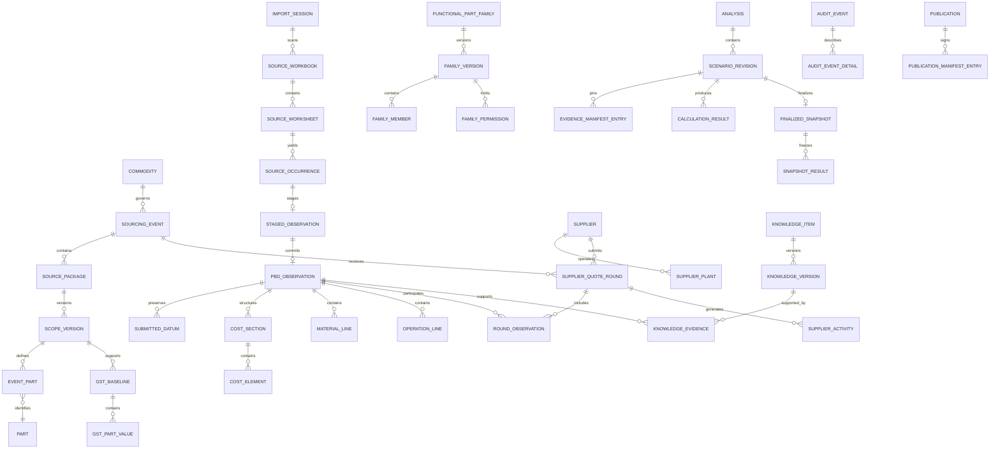

# Forge X Database Logical Design

Version: 0.1  
Recorded: September 2, 2026  
Status: Proposed implementation baseline derived from approved product-owner requirements

## 1. Purpose

This document converts the approved Forge X requirements into an implementable logical database model. It defines database boundaries, authoritative entities, immutable evidence chains, versioning, corporate-knowledge storage, derived projections, and initial keys. Physical SQLCipher provider selection, final type limits, and deployment packaging remain implementation decisions.

The model is designed to ensure that:

- supplier-submitted evidence is never rewritten;
- every analytical result resolves to its exact source population;
- supplier change behavior can be reconstructed over time;
- confirmed corporate knowledge is scoped, effective-dated, and evidence-backed;
- common buyer queries use indexed and precomputed structures without making caches authoritative;
- finalized analyses remain reproducible after new evidence, corrections, mappings, or rule versions arrive.

## 2. Database boundary

Forge X uses two logical database classes.

### 2.1 Central registry database

The registry contains slow-changing governed identity and authority data shared across commodities:

- organizational users, buyer codes, roles, and delegations;
- commodities and ownership;
- vehicle lines, programs, and program relationships;
- part identity and program applicability;
- supplier identity, plants, aliases, and corporate-family relationships;
- controlled units, currencies, activity types, and knowledge taxonomies;
- registry publications and registry audit history.

The registry does not contain supplier quotation facts or detailed PBD evidence.

### 2.2 Commodity database

Each commodity database contains the evidence, sourcing activity, calculations, and knowledge applicable to one governed commodity:

- imports, sources, extraction results, and staging;
- immutable PBD observations and detailed cost structures;
- sourcing events, source packages, scope versions, GST baselines, and quote rounds;
- supplier activity and active-position decisions;
- buyer actions, mappings, functional families, and interpretations;
- confirmed knowledge and corporate-standard cache entries;
- analysis scenarios, explicit evidence manifests, results, and finalized snapshots;
- rebuildable search and supplier-profile projections;
- publication, recovery, integrity, and audit history.

A rare multi-commodity source package is partitioned into separate commodity evidence populations. One observation has exactly one governing commodity database.

### 2.3 Registry cache

Every commodity database retains a versioned, read-only cache of the registry entities it references. The cache supports offline operation and historical display but does not become a second master. Each cached row records the central entity ID and registry publication version from which it was copied.

## 3. Modeling conventions

### 3.1 Identity

- Every authoritative row uses an immutable application-generated technical ID.
- Human identifiers such as source package number, supplier code, part number, program code, and commodity code are stored separately and governed by scoped alternate keys.
- IDs should be time-orderable and collision-resistant when supported by the approved stack; UUIDv7 is the initial candidate.
- Foreign keys reference technical IDs, never editable names.

### 3.2 Time

- `recorded_at_utc` states when Forge X committed the record.
- `business_valid_from` and `business_valid_to` state when knowledge applied in the business.
- `supersedes_id` links a new immutable version to the prior version.
- `recorded_sequence` provides a monotonic database-local ordering for audit-sensitive events.
- Timestamps are stored in UTC; the display time-zone identifier is retained where user interpretation matters.

### 3.3 Exact decimals

Governing commercial values must not use binary floating point. The logical representation contains:

- `submitted_lexeme`: exact source text;
- `decimal_coefficient`: signed base-10 integer represented without precision loss;
- `decimal_scale`: number of fractional decimal positions;
- `normalized_unit_id` and `currency_id` where applicable;
- `governing_1e4`: optional checked signed integer representing the approved four-decimal governing output;
- `precision_status`: `Eligible`, `Blocked`, or `Not Applicable`.

This coefficient/scale representation preserves arbitrary source precision. A checked four-decimal integer supports fast equality, filtering, aggregation, and indexing for eligible governing amounts. The calculation layer uses an approved base-10 decimal implementation and rounds only at defined output boundaries.

### 3.4 Immutability

Authoritative evidence, supplier activity, audit events, finalized analyses, and published manifests are append-only. Corrections use new rows and explicit relationships. Mutable workflow rows are limited to drafts, queues, leases, and rebuildable projections; their change history is still audited.

### 3.5 Deletion

Normal application workflows never physically delete business evidence. Records leave active use through status, eligibility, valid-to dates, supersession, or explicit exclusion. Exceptional legally required removal is a separate administrator recovery procedure and must leave a tamper-evident tombstone and publication reconciliation trail.

### 3.6 Authoritative versus derived

Tables are classified as:

- `A`: authoritative and append-only;
- `V`: authoritative and versioned by supersession;
- `W`: mutable workflow state with audited transitions;
- `D`: derived and atomically rebuildable;
- `C`: versioned cache of an external governing registry.

## 4. High-level entity relationship diagram

## 5. Central registry data dictionary

| Table | Class | Purpose | Principal columns | Keys and critical rules |
|---|---|---|---|---|
| `registry_publication` | A | Immutable published registry generation | `publication_id`, `registry_version`, `created_at_utc`, `schema_version`, `content_hash`, `signature`, `prior_publication_id` | PK `publication_id`; unique `registry_version`; hash-linked |
| `organization_user` | V | Organizational identity used for access and attribution | `user_id`, `directory_object_id`, `display_name`, `email`, `active_flag`, validity fields, `supersedes_id` | Unique active `directory_object_id`; identity corrections versioned |
| `buyer_code` | V | Governed buyer-code identity | `buyer_code_id`, `code`, `name`, validity fields | Unique active normalized `code` |
| `buyer_identity` | V | Effective-dated user-to-buyer-code relationship | `buyer_identity_id`, `user_id`, `buyer_code_id`, validity fields | No overlapping active duplicate relationship |
| `role_definition` | V | Controlled role catalog | `role_id`, `role_code`, `description`, `permission_set_version` | Unique active `role_code` |
| `authority_assignment` | V | Effective-dated user authority | `assignment_id`, `user_id`, `role_id`, `scope_type`, `scope_id`, validity fields, approval evidence | Scoped uniqueness; master authority explicitly represented |
| `delegation` | V | Temporary writing authority | `delegation_id`, `event_id_external`, `grantor_user_id`, `recipient_user_id`, `buyer_code_id`, start/end, reason | End after start; manager grant required; immutable history |
| `commodity` | V | Locked commodity identity | `commodity_id`, `commodity_code`, `locked_name`, `status`, validity fields | Unique active code and unique active normalized name; master-only correction |
| `commodity_assignment` | V | Buyer ownership/access by commodity | `assignment_id`, `commodity_id`, `buyer_code_id`, `assignment_role`, validity fields | One primary buyer per governed scope where required |
| `vehicle_line` | V | Governed vehicle-line identity | `vehicle_line_id`, `code`, `name`, validity fields | Scoped alternate key on normalized code/name |
| `program` | V | Program identity | `program_id`, `program_code`, `name`, `vehicle_line_id`, start/end dates, validity fields | Unique active program code within authority scope |
| `program_relationship` | V | Predecessor/successor and related-program links | `relationship_id`, `from_program_id`, `to_program_id`, `relationship_type`, rationale, validity fields | No self-link; versioned; cycle prevention for predecessor chain |
| `part` | V | Governed part identity | `part_id`, `normalized_part_number`, `display_part_number`, `canonical_description_id`, status, validity fields | Unique active normalized part number within approved identity scope |
| `part_description` | V | Exact and canonical descriptions without overwriting submissions | `description_id`, `part_id`, `description_text`, `description_type`, language, provenance | Submitted descriptions remain source evidence; canonical choice versioned |
| `part_program_applicability` | V | Part-to-program/vehicle applicability | `applicability_id`, `part_id`, `program_id`, position, validity fields | No overlapping identical active applicability |
| `supplier` | V | Supplier-code identity | `supplier_id`, `supplier_code`, `submitted_name_default`, legal identity status, validity fields | Supplier codes distinct by default; missing code handled provisionally in commodity DB |
| `supplier_alias` | V | Confirmed alias without merging identity | `alias_id`, `supplier_id`, `alias_text`, source, validity fields | Normalized alias scoped; conflicts require review |
| `supplier_plant` | V | Plant identity used for local economics | `plant_id`, `supplier_id`, `plant_code`, name, address/region evidence, validity fields | Plant remains separate from corporate family |
| `supplier_family` | V | Master-approved corporate family | `family_id`, `family_name`, validity fields | Master-authorized versioning |
| `supplier_family_member` | V | Supplier-to-family relationship | `membership_id`, `supplier_id`, `family_id`, validity fields, approval ID | No silent merge; underlying supplier preserved |
| `unit_definition` | V | Controlled unit catalog | `unit_id`, `unit_code`, category, canonical label, active flag, validity fields | Historical definition cannot be redefined or deleted |
| `currency_definition` | V | Currency identity for eligibility | `currency_id`, ISO code, exponent, active flag | Unique ISO code; no initial-release conversion |
| `controlled_term` | V | Activity, relationship, issue, context, and status taxonomies | `term_id`, `domain`, `code`, label, definition, validity fields | Unique active `(domain, code)`; old codes retained |
| `master_data_request` | W | Proposed governed correction or relationship | `request_id`, type, requester, proposed payload, status, reason, timestamps | Controlled state transition; decision required |
| `master_data_decision` | A | Immutable approval/rejection | `decision_id`, `request_id`, decision, approver, reason, timestamp | One terminal decision per request version |
| `registry_audit_event` | A | Tamper-evident registry audit chain | audit envelope and chain columns | Monotonic sequence; prior hash; signed publication anchor |

## 6. Commodity database data dictionary

### 6.1 Database, registry cache, and rules

| Table | Class | Purpose | Principal columns | Keys and critical rules |
|---|---|---|---|---|
| `commodity_database` | A | Database identity and governed commodity | `database_id`, `commodity_id`, `created_at_utc`, `schema_version`, `database_instance_nonce` | Exactly one identity row; commodity immutable |
| `schema_migration` | A | Applied migration ledger | `migration_id`, version, checksum, started/completed timestamps, status, checkpoint ID | Unique version/checksum; failed migration cannot masquerade as complete |
| `registry_cache_generation` | C | Imported registry publication | `cache_generation_id`, `registry_publication_id`, version, hash, imported timestamp, expiry status | Only verified generations become active |
| `registry_entity_cache` | C | Historical display and offline resolution | `cache_row_id`, generation ID, entity type/ID, payload, content hash | Unique entity per generation; never local master |
| `rule_version` | A | Versioned calculation, extraction, validation, and eligibility rules | `rule_version_id`, domain, semantic version, checksum, effective date, implementation version | Unique `(domain, semantic_version)`; immutable |
| `engine_version` | A | Application/calculation engine identity | `engine_version_id`, build ID, source revision, package hash | Referenced by every calculation run |

### 6.2 Import and source lineage

| Table | Class | Purpose | Principal columns | Keys and critical rules |
|---|---|---|---|---|
| `import_session` | W | User-visible import lifecycle | `import_session_id`, context type/ID, `initiated_by`, started/completed timestamps, status, engine version | Controlled transition; cancellation safe |
| `import_transaction` | A | Atomic import attempt and reconciliation boundary | `transaction_id`, session ID, sequence, status, counts, committed timestamp | Every scanned tab reconciles to one terminal status |
| `source_workbook` | A | Immutable file occurrence metadata | `workbook_id`, transaction ID, filename, size, file hash, modified/displayed dates, source locator | Identical file hash may recur; occurrences retained |
| `source_worksheet` | A | Every scanned worksheet | `worksheet_id`, workbook ID, ordinal, submitted name, visibility, dimension, sheet fingerprint | Unique workbook/ordinal; no silently omitted sheet |
| `source_occurrence` | A | Candidate PBD region or tab occurrence | `occurrence_id`, worksheet ID, region coordinates, logical fingerprint, detection result, terminal status | Status is committed, duplicate, blocked, ignored, or failed |
| `extraction_result` | A | Parser output and diagnostics | `extraction_result_id`, occurrence ID, adapter/rule version, structure category, confidence facts, payload hash | Multiple attempts retained; one selected by audited decision |
| `extraction_exception` | A | Structured extraction, identity, formula, or precision issue | `exception_id`, extraction result ID, type, severity, location, evidence, blocking flag | Resolution never overwrites exception |
| `source_datum` | A | Exact cell/range evidence | `source_datum_id`, worksheet ID, cell/range, submitted lexeme, formula text, cached value, style/context hash | Immutable; logical observation fields point here |
| `fingerprint` | A | Layered duplicate/integrity fingerprints | `fingerprint_id`, entity type/ID, algorithm, purpose, digest, rule version | Unique scoped digest where required; algorithm version retained |

### 6.3 Staging and committed PBD evidence

| Table | Class | Purpose | Principal columns | Keys and critical rules |
|---|---|---|---|---|
| `staged_observation` | W | Recoverable pre-commit observation | `staged_id`, occurrence ID, supplier/part provisional identity, context, status, blocking count | Cannot enter governing analysis |
| `staging_issue` | A | Missing identity, unit, currency, precision, or context | `staging_issue_id`, staged ID, issue type, source datum, status-at-creation | Resolution stored separately |
| `staging_resolution` | A | Buyer/master decision resolving an issue | `resolution_id`, issue ID, decision, selected entity/value, user, reason, timestamp | Append-only; latest valid decision governs commit candidate |
| `pbd_observation` | A | Immutable committed supplier/PCE observation | `observation_id`, occurrence ID, context type, supplier/plant/part IDs, submitted description, economic date, structure category, eligibility state | One commit per selected staged version; never updated |
| `observation_identity` | A | Original and resolved identifiers | `identity_id`, observation ID, identity type, submitted value, resolved registry ID, confirmation ID | Preserves provisional and confirmed history |
| `submitted_datum` | A | Semantic field mapped to exact source evidence | `submitted_datum_id`, observation ID, field code, source datum ID, exact-decimal fields, text/date/bool value, unit/currency | One typed value form; source link required |
| `cost_section` | A | Submitted structural section | `section_id`, observation ID, parent section ID, submitted label, normalized category, ordinal, mapping version | Submitted and normalized categories separate |
| `cost_element` | A | Cost amount/rate/basis record | `element_id`, section ID, element type, exact-decimal fields, basis reference, unit/currency, source datum | No unsupported inferred value |
| `material_line` | A | Material or purchased-content line | `material_line_id`, observation ID, submitted identity/description, quantity, rate, amount, units, source references | Each numeric field retains lineage |
| `operation_line` | A | Detailed manufacturing operation | `operation_line_id`, observation ID, submitted operation, sequence, time, labor/machine/burden values, units, source references | Aggregate structures need not fabricate operation rows |
| `formula_evidence` | A | Formula and dependency representation | `formula_evidence_id`, observation/source datum, formula text, parsed expression, parser version, status | Original formula preserved; parse result versioned |
| `formula_integrity_event` | A | Expected/submitted/recalculated reconciliation | `integrity_event_id`, observation ID, rule version, expected/recalculated values, variance, classification, evidence | Separate exceptions; no double counting |
| `observation_eligibility` | V | Versioned analytical eligibility decision | `eligibility_id`, observation ID, role/domain, status, reason, valid dates, confirmer, supersedes ID | Evidence retained even when excluded |

### 6.4 Sourcing events, scope, GST, and supplier rounds

| Table | Class | Purpose | Principal columns | Keys and critical rules |
|---|---|---|---|---|
| `sourcing_event` | V | Immutable event identity and versioned label/context | `event_id`, source package lookup context, readable name, buyer code, primary buyer, status, created timestamp | Event ID immutable; label corrections versioned |
| `source_package` | V | Governing business identifier | `source_package_id`, event ID, package number, package role, status, validity fields | Active package number unique per commodity; duplicates open existing event |
| `scope_version` | A | Immutable official event-part population version | `scope_version_id`, source package ID, version number, predecessor ID, reason, confirmed by/at | Unique package/version; one current pointer held separately |
| `scope_activation` | A | Audited selection of current scope | `activation_id`, source package ID, scope version ID, decision user/time/reason | Latest valid decision resolves current scope |
| `event_part` | A | Part membership in a scope version | `event_part_id`, scope version ID, part ID, submitted description, scope action, predecessor event-part ID | Unique scope/part/position as governed |
| `gst_baseline` | A | Immutable official company target/volume baseline | `gst_baseline_id`, source package ID, scope version ID, baseline version, source import ID, status | Corrections create new version |
| `gst_part_value` | A | Part/year target and FPV | `gst_part_value_id`, baseline ID, event part ID, program year, target exact decimal, FPV exact decimal, units | Unique baseline/part/year/measure |
| `take_rate_validation` | A | Deterministic anomaly result | `validation_id`, baseline ID, rule version, affected parts, result, severity | Original validation retained |
| `take_rate_decision` | A | Buyer correction/accepted exception | `decision_id`, validation ID, decision, reason, user/time, replacement baseline ID | Required before finalization if unresolved |
| `supplier_quote_round` | V | Supplier-specific commercial round | `round_id`, event ID, supplier ID, positive round number, description, submission/economic date, status | Unique event/supplier/round number; additions allowed |
| `round_batch` | A | Staggered import batch within a supplier round | `batch_id`, round ID, import transaction ID, confirmed supplier/round metadata | Batch remains immutable |
| `round_observation` | A | Observation membership and submitted position | `membership_id`, round ID, observation ID, batch ID, part ID, membership status | Observation can be preserved in conflicting membership states |
| `round_conflict` | A | Same-part conflict within a round | `conflict_id`, round ID, prior/new membership IDs, conflict type | Decision required; neither overwritten |
| `round_conflict_decision` | A | Replace-within-round or new-round decision | `decision_id`, conflict ID, action, reason, user/time | Immutable decision history |
| `round_activation` | A | Package-level active commercial decision | `activation_id`, event/supplier IDs, round ID, decision, user/time/reason | Latest valid activation resolves active round; new imports never activate silently |
| `part_activation_exception` | A | Exceptional part-level active record | `exception_id`, round activation ID, event part ID, membership ID, reason | Explicitly exceptional and audited |
| `carry_forward_decision` | A | Omitted-part treatment | `decision_id`, target round ID, event part ID, prior observation ID, decision, validity evidence, user/time | Original lineage retained; no implied resubmission |
| `incumbency_assignment` | V | Event/part-specific incumbency | `assignment_id`, event ID, event part ID optional, supplier ID, validity, confirmer | Not a permanent supplier attribute |
| `pce_model_membership` | A | Classifies PCE should-cost observation | `membership_id`, event ID, part ID, observation ID, target supplier optional, region | Never enters supplier behavior evidence |

### 6.5 Supplier activity and behavior

| Table | Class | Purpose | Principal columns | Keys and critical rules |
|---|---|---|---|---|
| `supplier_activity` | A | Controlled immutable supplier-change event | `activity_id`, supplier/plant/event/round/part IDs, `activity_type`, occurred/recorded times, before/after refs, significance facts | Both evidence references required when applicable |
| `activity_measure` | A | Structured change amount by measure/category | `activity_measure_id`, activity ID, measure code, before/after/delta exact decimals, unit/currency | No cross-unit/currency delta without explicit derived conversion rule |
| `supplier_profile_run` | A | Rebuild generation for scoped profile | `profile_run_id`, supplier/plant/commodity/region scope, evidence cutoff, rule/calculation/engine versions, build manifest, status | Completed run immutable |
| `supplier_profile_metric` | D | Fast metric projection | `metric_id`, profile run ID, metric code, value, evidence count, event count, confidence classification | Derived; rebuildable |
| `supplier_profile_finding` | D | Supported profile conclusion | `finding_id`, profile run ID, finding type/status, evidence count, explanation token/payload | Must link to evidence manifest |
| `profile_evidence_entry` | A | Explicit included/excluded population | `entry_id`, profile run ID, observation/activity ID, role, eligibility, exclusion reason | Profile reproducibility does not depend on a future query |
| `supplier_search_projection` | D | Buyer-facing indexed supplier summary | scope IDs, latest run ID, key status/metrics, generation ID | Atomically replaced by generation |

### 6.6 Functional families and knowledge

| Table | Class | Purpose | Principal columns | Keys and critical rules |
|---|---|---|---|---|
| `functional_part_family` | A | Immutable family identity | `family_id`, readable name, created by/at | Identity survives renamed versions |
| `family_version` | V | Confirmed family definition | `family_version_id`, family ID, version, relationship type, rationale, applicable programs, confirmer, validity fields, supersedes ID | No silent inference; finalized analyses pin version |
| `family_member` | A | Version-specific part membership | `member_id`, family version ID, part ID, program/position context, member role | Unique scoped membership |
| `family_comparison_permission` | A | Field/category comparison scope | `permission_id`, family version ID, measure/category, eligibility: governing/directional/not-comparable | Exact-part status never implied |
| `knowledge_item` | A | Stable identity for a reusable knowledge concept | `knowledge_item_id`, knowledge type, owning scope type/ID, created at | Does not contain mutable fact value |
| `knowledge_version` | V | Bitemporal knowledge assertion | `knowledge_version_id`, item ID, level, structured payload, business-valid dates, recorded dates, status, confirmer/approver, supersedes ID | Levels: Observed, Confirmed, Corporate Standard |
| `knowledge_scope` | A | Multi-dimensional applicability | `scope_id`, knowledge version ID, supplier, plant, commodity, process, family, region, program IDs as applicable | At least one defined scope; specificity computable |
| `knowledge_evidence` | A | Supporting or contradicting evidence | `evidence_id`, knowledge version ID, evidence entity type/ID, role, weight facts, note | Evidence never copied or rewritten |
| `knowledge_conflict` | A | Equally specific or overlapping assertions | `conflict_id`, left/right version IDs, conflict type, detected rule/time, status | Unresolved conflict blocks automatic governing selection |
| `knowledge_resolution` | A | Authorized conflict decision | `resolution_id`, conflict ID, selected/superseding version, decision, reason, authority, time | Decision does not erase losing evidence |
| `knowledge_candidate` | D | Suggested reusable mapping/fact | `candidate_id`, type, proposed scope/payload, supporting counts, generation/rule version, status | Cannot govern analysis until confirmed |

### 6.7 Analysis, scenarios, and results

| Table | Class | Purpose | Principal columns | Keys and critical rules |
|---|---|---|---|---|
| `analysis` | V | Analysis identity within an event | `analysis_id`, event ID, analysis type, readable name, status, created by/at | Identity stable; labels versioned if needed |
| `scenario_revision` | A | Immutable completed draft calculation revision | `scenario_revision_id`, analysis ID, revision, parent revision ID, name, selected rounds, GST/PCE/scope versions, assumptions hash | Incomplete keystrokes not persisted as revisions |
| `scenario_input` | A | Exact explicit input/assumption | `input_id`, scenario revision ID, input code, typed exact value, source/confirmation, unit/currency | No implicit mutable global input |
| `evidence_manifest_entry` | A | Explicit pinned evidence population | `entry_id`, scenario revision ID, evidence entity type/ID, included flag, analytical role, exclusion reason | Complete included and excluded candidate manifest |
| `calculation_run` | A | Engine execution envelope | `run_id`, scenario revision ID, engine/rule/calculation versions, started/completed, status, input/output hashes | Failed and cancelled runs retained |
| `calculation_result` | A | Governing result by grain | `result_id`, run ID, result code, supplier/part/year/category dimensions, exact-decimal output, unit/currency, confidence class | No binary floats; calculation lineage required |
| `calculation_lineage` | A | Result-to-input/evidence dependency edges | `lineage_id`, result ID, source entity type/ID, dependency role, ordinal | Enables complete result explanation |
| `finalized_snapshot` | A | Immutable decision-state finalization | `snapshot_id`, analysis/scenario/run IDs, finalized by/at, open-action count, manifest hash, audit anchor | Never recalculated or updated |
| `snapshot_result` | A | Frozen result payload for durable rendering | `snapshot_result_id`, snapshot ID, result code/dimensions/value, presentation rule version | Independent of future projections |
| `snapshot_action` | A | Frozen open/resolved action state | `snapshot_action_id`, snapshot ID, action/version ID, frozen status/impact/text | Later action changes do not alter snapshot |

### 6.8 Buyer actions and interpretations

| Table | Class | Purpose | Principal columns | Keys and critical rules |
|---|---|---|---|---|
| `buyer_action` | A | Stable action identity | `action_id`, event/supplier/part/evidence IDs, issue type, created at/by | One identity; state versions separate |
| `buyer_action_version` | V | Controlled action status and ownership | `action_version_id`, action ID, status, financial impact, required action, owner, note, recorded at/by, supersedes ID | Resolved/accepted exception requires required rationale fields |
| `buyer_note` | A | Append-only working or decision note | `note_id`, parent entity type/ID, note type, text, author/time, supersedes note ID | Corrections supersede; never edit/delete |
| `interpretation` | A | Buyer-confirmed mapping/classification | `interpretation_id`, subject entity, interpretation type/value, scope, rationale, confirmer/time | Version changes through supersession |

### 6.9 Audit, publication, and recovery

| Table | Class | Purpose | Principal columns | Keys and critical rules |
|---|---|---|---|---|
| `audit_event` | A | Tamper-evident action envelope | `audit_event_id`, sequence, event type, actor, UTC/display zone, session/workstation, app version, method, reason code/text, prior hash, event hash | Unique monotonic sequence; hash chain verified on open/publication/restore |
| `audit_event_detail` | A | Structured before/after and affected entities | `detail_id`, audit event ID, entity type/ID, field/path, before payload, after payload | Consequential action must be explainable |
| `local_checkpoint` | A | Integrity-checked recoverable local state | `checkpoint_id`, created time, database/schema versions, file/content hash, audit anchor, verification status | Valid only after integrity check |
| `publication` | A | SharePoint publication attempt/result | `publication_id`, checkpoint ID, destination, status, initiated/completed times, package hash, audit anchor, signature | Attempts retained; verified success explicit |
| `publication_manifest_entry` | A | Published files and logical generations | `entry_id`, publication ID, type/path, size, hash, schema/rule/evidence versions | Signed manifest covers entries |
| `sync_queue_item` | W | Offline publication queue | `queue_item_id`, publication ID, state, retry count, lease, last error | Idempotent processing; audited transitions |
| `sync_conflict` | A | Local/remote generation conflict | `conflict_id`, local/remote publication IDs, detected time, type, status | Never silent last-writer-wins |
| `restore_event` | A | Restore test or production restore | `restore_id`, publication/checkpoint ID, target instance, started/completed, integrity/audit/schema/result status | Backup valid only after automated restore verification |

## 7. Knowledge resolution algorithm

For an analysis context and knowledge type:

1. Select versions recorded by the analysis cutoff and business-valid for the analysis economic date.
2. Exclude inactive, superseded-for-that-period, expired, unit-incompatible, currency-incompatible, or analytically ineligible versions.
3. Match all defined scope dimensions.
4. Rank scope from exact supplier plant + exact part through company-wide corporate standard.
5. If one highest-specificity version remains, select it and record the knowledge-version ID in calculation lineage.
6. If equally specific active versions conflict, create or reference a `knowledge_conflict`; do not select silently.
7. If no confirmed version applies, expose eligible observed evidence or candidates only as non-governing context.

The resolution result itself is persisted with the analysis manifest so later knowledge cannot change a completed analysis.

## 8. Authoritative active-state pattern

“Current” state is resolved from immutable decisions rather than by rewriting evidence:

- current event scope: latest valid `scope_activation`;
- active supplier round: latest valid `round_activation` for event and supplier;
- active part exception: latest valid exception decision within that activation;
- current action state: latest valid `buyer_action_version`;
- current knowledge assertion: business-valid, recorded-visible, non-superseded `knowledge_version`;
- current registry cache: latest verified and non-expired `registry_cache_generation`;
- current profile projection: atomically published completed `supplier_profile_run` generation.

Convenience views may expose these resolutions, but the underlying decisions remain append-only.

## 9. Required database views

Initial read models should include:

- `v_current_event_scope`
- `v_active_supplier_round`
- `v_active_round_part_position`
- `v_current_buyer_action`
- `v_eligible_pbd_observation`
- `v_observation_piece_price`
- `v_quote_round_part_change`
- `v_supplier_activity_timeline`
- `v_applicable_knowledge`
- `v_latest_supplier_profile`
- `v_analysis_evidence_manifest`
- `v_finalized_analysis_summary`
- `v_source_tab_reconciliation`
- `v_publication_readiness`

Views that resolve temporal state must accept or expose an as-of recording cutoff when used for historical reproduction.

## 10. Open physical-design decisions

The following must be resolved during physical schema prototyping and benchmarking:

- approved SQLCipher Enterprise provider, license, key release, and packaging;
- UUIDv7 storage as 16-byte binary versus canonical text;
- maximum coefficient size and checked integer ranges for each commercial measure;
- encrypted attachment/package policy for any source fragments retained beyond cell-level evidence;
- JSON usage boundaries for immutable diagnostic payloads versus queryable normalized fields;
- full-text implementation and tokenizer;
- registry-cache expiry and offline grace policy;
- exact audit-event canonicalization and signing algorithms;
- physical page size, journal mode, vacuum/checkpoint policy, and corruption detection;
- final benchmark-driven index set.

These choices may optimize storage but must not weaken the logical guarantees in this document.
