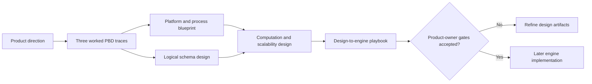

# Forge X design-build package — September 11, 2026

Status: active architecture and operating-design baseline. No engine implementation is authorized by this package.

## Purpose

This package defines what Forge X must become before production coding begins. It turns the product direction and three PBD traces into a reviewable platform architecture, logical schema, process map, computation model, scalability plan, and staged build playbook.

## Reading order

1. `FORGE_X_DESIGN_HANDOFF_2026-09-11.md` — product direction and evidence boundary.
2. `FORGE_X_COST_EVIDENCE_COMPARABILITY_SPEC_2026-09-11.md` — the three worked source-to-action traces.
3. `FORGE_X_PLATFORM_PROCESS_BLUEPRINT_2026-09-11.md` — platform boundaries, modules, workflows, and operating states.
4. `FORGE_X_COST_INTELLIGENCE_SCHEMA_DESIGN_2026-09-11.md` — proposed logical records, relationships, constraints, and trace coverage.
5. `FORGE_X_COMPUTATION_SCALABILITY_DESIGN_2026-09-11.md` — deterministic computation, comparability, model governance, performance, and recovery.
6. `FORGE_X_DESIGN_TO_ENGINE_PLAYBOOK_2026-09-11.md` — review gates, design worksheets, implementation sequence, and evidence required to authorize coding.

The existing database-design and model-requirement documents remain authoritative for approved product-owner decisions. Where this package proposes a new choice, it is explicitly labeled `Proposed` and must not be treated as implemented or approved merely because it appears in a diagram.

## Phase boundary

The current phase builds:

- domain logic and terminology;
- platform and deployment boundaries;
- logical schema and invariants;
- ingestion, interpretation, calculation, comparison, finding, and publication processes;
- computation and reproducibility contracts;
- capacity, query, failure, recovery, and scalability plans;
- a practical playbook for later implementation.

The current phase does not build:

- migrations or production tables;
- service or application code;
- workbook adapters beyond the already checkpointed prototype;
- a production calculation engine;
- UI screens, automated supplier conclusions, or production deployment.

Coding begins only after the applicable design gates in the playbook are accepted.

