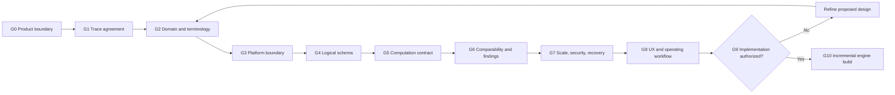

# Forge X design-to-engine playbook — September 11, 2026

Status: active design and future-build control plan. This playbook does not authorize engine coding.

## 1. How to use this playbook

Use each phase as a gated worksheet. Complete the named artifacts, record open decisions, validate against non-private examples, and obtain the stated acceptance before advancing. A phase may prototype a representation on paper or with disposable synthetic artifacts, but production migrations, services, UI, and engine code begin only at the implementation-authorization gate.

Each design record must label content as:

- `Approved` — explicitly accepted product rule;
- `Proposed` — recommended design awaiting acceptance;
- `Observed` — present in source evidence but not necessarily correct or reusable;
- `Open` — unresolved choice that may change implementation;
- `Deferred` — intentionally outside the current release boundary.

## 2. Design-build gates

| Gate | Required decision | Evidence required to pass |
|---|---|---|
| G0 Product boundary | Private/shared separation, non-negotiable evidence rules, current phase boundary | Design handoff accepted |
| G1 Trace agreement | Operation/material, annual allocation, and wiring traces represent the intended modeling problem | Worked trace specification reviewed |
| G2 Domain and terminology | Canonical terms, fact types, roles, grains, bases, and finding classes | Domain glossary and ambiguity list |
| G3 Platform boundary | Workstation, registry, company workspace, shared knowledge, publication, and authority topology | Platform/process blueprint accepted |
| G4 Logical schema | Record families, ownership, keys, invariants, state/version rules, and trace coverage | Logical schema and integrity matrix accepted |
| G5 Computation contract | Expression representation, precision, DAG rules, reconciliation, manifests, and reproducibility | Computation design plus hand-calculated examples |
| G6 Comparability/findings | First population, dimensions, weighting, finding claims, and confirmation authority | Population worksheet and finding examples |
| G7 Scale/security/recovery | Capacity envelope, performance budgets, privacy classification, encryption/key boundary, checkpoint/restore | Benchmark and threat/recovery plans |
| G8 UX/operations | Buyer workflow, review queues, progressive disclosure, action and finalization behavior | Screen/report wireframes and operator walkthrough |
| G9 Implementation authorization | Scope, acceptance tests, migration boundary, implementation order, and explicit approval to code | Signed/recorded build brief |
| G10 Incremental build | One vertical slice at a time; no broad schema or engine leap | Passing acceptance evidence per increment |

## 3. Workstream control sheet

| Workstream | Current artifact | Status | Next design output | Coding gate |
|---|---|---|---|---|
| Product/evidence boundary | Design handoff and model requirements | Recorded | Resolve open authority/publication questions | G0/G6 |
| Worked cost logic | Cost-evidence/comparability specification | Proposed | Product-owner review of all three traces | G1 |
| Domain model | Logical schema design | Proposed | Controlled glossary and catalog seeds | G2/G4 |
| Platform architecture | Platform/process blueprint | Proposed | Deployment and isolation decision record | G3/G7 |
| Computation | Computation/scalability design | Proposed | Expression-format decision and manual golden cases | G5 |
| Comparability | First-population rules in spec | Proposed | Filled population worksheet with exclusions | G6 |
| Findings/actions | Finding contract in spec | Proposed | Example findings at every allowed class | G6/G8 |
| Scalability | Acceptance envelope and workload design | Proposed | Hardware profile and benchmark workload | G7 |
| Security/recovery | Existing model/database design | Partly approved | Threat boundary, provider/key choice, recovery objectives | G7 |
| Buyer experience | Requirements and workflow blueprint | Partly approved | Screen/report wireframes and operating walkthrough | G8 |
| Implementation | Existing prototype through migration 0052 | Checkpointed | Later build brief; no current changes | G9 |

## 4. Worked-trace worksheet

Complete one copy for every supported PBD calculation pattern.

| Field | Required entry |
|---|---|
| Trace ID and revision | Stable design identifier and date |
| Source role | Supplier evidence, scenario, benchmark, estimate, generated analysis, or unresolved |
| Worksheet roles | Input, calculation, combined, supporting, generated, ignored, unresolved |
| Observation grain | Supplier/part/plant/event/round or other exact grain |
| Source fields | Labels, cells/ranges, lexemes, formulas, units, notes, dependencies |
| Manufacturing subjects | Part, material, operation, equipment, labor class, pool, program |
| Typed measures | Rate, quantity, time, amount, percent, weight, length, volume, denominator |
| Relationship graph | Inputs, outputs, conditions, bases, intermediate results, rounding boundaries |
| Validation rules | Required fields, ranges, unit checks, reconciliation tolerances, exceptions |
| Eligibility by use | Commercial, structure, formula, benchmark, profile, scenario |
| Comparison dimensions | Specification, process, equipment, geography, time, volume, terms, inclusions |
| Possible findings | Formula, peer, modeled, directional, or confirmed-commercial boundary |
| Possible actions | Supplier question, evidence request, negotiation, sourcing, process change |
| Missing evidence | Exact information needed to confirm or reject conclusions |
| Schema coverage | Existing record, proposed extension, or unresolved concept |
| Privacy classification | Private, company-shared, approved shared knowledge, public/external |

Trace acceptance requires a reviewer to follow source -> normalized meaning -> relationship -> result -> population -> finding -> action without an unexplained transformation.

## 5. Controlled vocabulary worksheet

Before coding, establish versioned seeds for:

| Catalog | Initial contents to decide |
|---|---|
| Measure types | Amount, rate, quantity, duration, output/cycle, staffing, percent, weight, length, volume, denominator |
| Measure roles | Input, output, adjustment, condition, reference, numerator, denominator |
| Cost categories | Material, purchased component, direct labor, machine, variable burden, fixed burden, overhead categories, profit, logistics, packaging, tooling, capital, engineering |
| Relationship types | Extension, aggregation, allocation, markup, yield/scrap, recovery, conversion, amortization, reconciliation |
| Document roles | Supplier evidence, buyer scenario, market benchmark, engineering estimate, generated analysis, unresolved |
| Worksheet roles | Supplier input, supplier calculation, combined, supporting interpretation, generated analysis, non-PBD, unresolved |
| Eligibility uses | Commercial, cost structure, formula, benchmark, supplier profile, scenario, publication |
| Comparison statuses | Matched, mismatch, missing, approved transformation, not applicable |
| Finding classes | Formula discrepancy, peer evidence difference, modeled opportunity, directional signal, confirmed commercial saving |
| Confidence | Define high, medium, low through evidence conditions—not intuition |
| Reason codes | Every exclusion, block, exception, conflict, and supersession reason |

For each entry record definition, allowed units/grains, synonyms, exclusions, governing authority, version, effective date, and examples.

## 6. Cost-relationship design worksheet

| Design question | Decision record |
|---|---|
| What is the economic statement? | Human-readable equation and definition |
| What are the typed inputs? | Measure, unit, currency, grain, period, provenance |
| What conditions apply? | Required flags, nonzero denominators, applicability scope |
| What is the output? | Measure, unit, currency, grain, period |
| Where is the rounding boundary? | Scale and mode |
| Is there a source formula? | Exact source evidence and parser status |
| Is there a Forge rule? | Rule ID/version and approval source |
| How do source and Forge results reconcile? | Expected, calculated, variance, classification |
| What may become shared knowledge? | Scope, evidence, dates, approval, conflicts |
| What blocks governing use? | Missing evidence, unit/basis mismatch, unresolved role or mapping |

### Proposed expression-decision exercise

Evaluate at least three representation options before G5:

1. restricted expression abstract syntax tree;
2. declarative relationship operators with typed terms;
3. versioned calculation functions referenced by rule ID.

Score each against exact decimals, unit checking, conditions, aggregation, explainability, formula comparison, safe execution, versioning, testability, migration stability, and AI navigability. A hybrid may be selected, but one representation must be authoritative for execution.

## 7. Comparability population worksheet

| Section | Required entry |
|---|---|
| Target | Measure, grain, unit, currency, intended governing/directional use |
| Candidate query | Deterministic source-role, scope, and cutoff rules |
| Required dimensions | Exact list and whether each may transform |
| Member manifest | Every included, excluded, blocked, and context-only item |
| Exclusion reasons | Controlled code plus readable explanation |
| Weighting | Raw record, independent event, supplier, or approved alternative |
| Minimum evidence | Counts, event diversity, date coverage, missingness limits |
| Output statistics | Exact descriptive/model outputs and rounding |
| Limitations | Population boundaries visible to buyers |
| Approval | Rule version, reviewer, date, and applicable scope |

### First-population recommendation

Begin with direct labor rate under same economic year, region, plant scope, currency/hour unit, and confirmed rate-inclusion basis. It uses existing evidence patterns and exercises role, unit, time, geography, basis, duplicate weighting, manifest, and finding controls without requiring the full material or allocation graph.

Machine rates follow only after process/equipment signatures are accepted. Wiring standard minutes follow after activity-unit and specification mappings are accepted. Annual allocations remain directional until cost-pool and denominator definitions are stable.

## 8. Finding and action worksheet

| Field | Required entry |
|---|---|
| Finding class | One approved class only |
| Challenged item | Exact source measure, assumption, relationship, or result |
| Evidence | Direct lineage and source availability |
| Comparison population | Immutable context and member manifest |
| Calculation result | Result ID, rule/engine versions, output basis |
| Impact | Per-part/annual/lifecycle amount with volume, time, unit, currency, and scope |
| Confidence | Evidence-based classification |
| Uncertainty | Explicit known limitations |
| Supplier question | Neutral, specific, answerable question |
| Required response evidence | Documents, assumptions, rates, timing, or calculations needed |
| Buyer action | Owner, status, due/decision context, and closure evidence |
| Promotion condition | Exact evidence/decision needed for a stronger claim |

Example neutral form: `The submitted machine-cost relationship does not reconcile to the retained rate, cycle, output-per-cycle, and quantity inputs under the stated hourly/second basis. Please provide the intended calculation and identify any setup, utilization, or included-cost assumption not shown in the PBD.`

## 9. Platform decision records

Create an ADR or equivalent decision record for each item before G9:

- company workspace and shared-knowledge isolation;
- central registry publication/cache and offline authority;
- source-file retention and external availability;
- approved database/encryption provider and key lifecycle;
- document adapter trust boundary;
- expression/rule execution representation;
- unit catalog and future conversion policy;
- background worker, cancellation, lease, and recovery boundary;
- publication destination, conflict, signing, and restore behavior;
- AI suggestion, human confirmation, and automatic-publication authority.

Each decision records context, options, choice, consequences, security/privacy impact, migration impact, validation evidence, owner, date, and superseded decision where applicable.

## 10. Scalability and recovery worksheet

| Dimension | Required design evidence |
|---|---|
| Scale | Observation, detail-row, relationship-term, lineage, audit, and artifact counts |
| Hardware | CPU, memory, storage, encryption overhead, network assumptions |
| Workloads | Ingest, map, compare, analyze, search, render, publish, restore |
| Targets | p50/p95/max latency, throughput, memory, database/package size |
| Queries | SQL shape, indexes, query-plan fingerprint, expected rows |
| Failure tests | Cancellation, source loss, dependency loss, crash, conflict, corruption |
| Recovery objectives | Proposed RPO/RTO and required product-owner approval |
| Checkpoints | Creation trigger, integrity checks, retention, encryption, naming |
| Restore proof | Automated restore, schema/audit/result reproduction, evidence record |

Use deterministic non-private datasets at smoke, representative, and 250,000-observation/10-million-detail acceptance scale. Correctness and lineage pass before latency is accepted.

## 11. Buyer operating walkthrough

Before UI coding, walk through this scenario with static wireframes or a disposable prototype:

1. create/select commodity and sourcing event;
2. select source package and declare import context;
3. discover workbooks and review document/worksheet roles;
4. resolve supplier, part, plant, currency, units, and economic date;
5. inspect one material/operation relationship and reconciliation;
6. view eligible and excluded comparison evidence with reasons;
7. run a scenario and inspect complete lineage;
8. read a neutral finding and issue a supplier question;
9. record response, revise interpretation/population, and rerun;
10. finalize with open actions/limitations visible;
11. generate, validate, checkpoint, publish, and verify continuity status.

The walkthrough passes only when a buyer can understand the conclusion and recover its evidence without database knowledge.

## 12. Later implementation increments

After G9, build in this order. Each increment is independently recoverable and releasable only when its acceptance tests pass.

| Increment | Scope | Acceptance evidence |
|---|---|---|
| I1 Role-aware evidence | Document/worksheet roles and dependencies | Wiring summary-input case and generated-analysis exclusion |
| I2 Trace A facts | Flexible material/operation measures and classifications | Synthetic component material and operation preserved without loss |
| I3 Cost graph | Typed relationships, compiler, exact execution, reconciliation | Golden operation/material calculations and corruption detection |
| I4 Comparison population | Context, members, dimensions, weighting, freeze | Included/excluded manifest reproduces exactly |
| I5 Finding-to-action | Finding classes, uncertainty, action, promotion controls | Directional finding cannot claim confirmed saving |
| I6 Trace B allocation | Annual pools, denominators, amortization/payment treatment | CPV/FPV and annual/per-vehicle examples reproduce |
| I7 Trace C wiring | Matrix grain, cross-sheet material/labor dependencies | Wire/component/labor calculations reproduce per part |
| I8 Search/profile/read models | Atomic projections and drill-down | Full-scale query and rebuild tests |
| I9 Output/publication | Deterministic artifacts, validation, checkpoint, publish/restore | End-to-end reproduction from restored package |
| I10 Statistical models | Approved populations, diagnostics, uncertainty, model findings | Statistical acceptance plan and no automatic saving promotion |

No increment may silently widen evidence scope or introduce unapproved categories merely to support a new template.

## 13. Build-brief template for G9

The implementation brief must state:

- exact approved increment and excluded work;
- accepted design artifacts and decision versions;
- proposed files/modules/migrations;
- schema additions and forward/backward compatibility;
- public service interfaces and error behavior;
- synthetic fixtures and golden calculations;
- unit, integration, integrity, migration, performance, privacy, and recovery tests;
- acceptance criteria and evidence owner;
- rollback/recovery procedure;
- checkpoint and publication plan;
- unresolved risks that remain non-blocking.

Only this brief converts the design package into a coding task.

## 14. Review checklist

Before accepting the design package:

- [ ] The three source traces are economically accurate enough to drive the common model.
- [ ] No source worksheet is included or excluded by name alone.
- [ ] Submitted evidence and analytical interpretation are visibly separate.
- [ ] Aggregated supplier evidence is preserved without an invented split.
- [ ] Every cost relationship has typed inputs, output, basis, unit, and rounding boundary.
- [ ] Annual allocations name their cost pool and denominator.
- [ ] Comparability is dimension-based and retains every exclusion.
- [ ] Private evidence and shared knowledge are isolated.
- [ ] Finding classes cannot overstate modeled or peer evidence.
- [ ] The scale plan covers data growth, concurrency, failure, and restore.
- [ ] Buyer workflow exposes evidence, limitations, and required action.
- [ ] Open physical and authority decisions are assigned to a gate.
- [ ] Engine coding remains blocked until G9 is explicitly accepted.

## 15. Current next actions

1. Review and accept or revise the three worked traces (G1).
2. Approve the initial controlled vocabulary and cost-relationship expression evaluation criteria (G2/G5 preparation).
3. Select the first comparison population and required dimensions (G6 preparation).
4. Record the company/private/shared deployment-isolation decision (G3/G7 preparation).
5. Create static buyer workflow/report wireframes (G8 preparation).

These actions deepen the design and reduce implementation rework without beginning the engine build.
