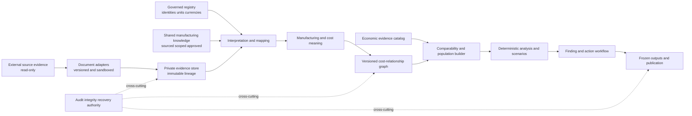
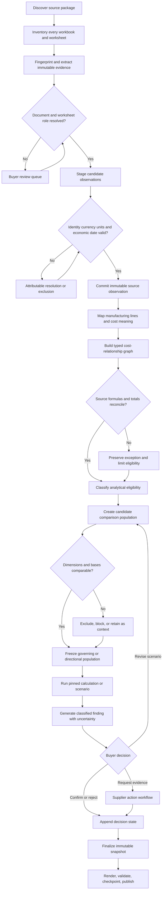
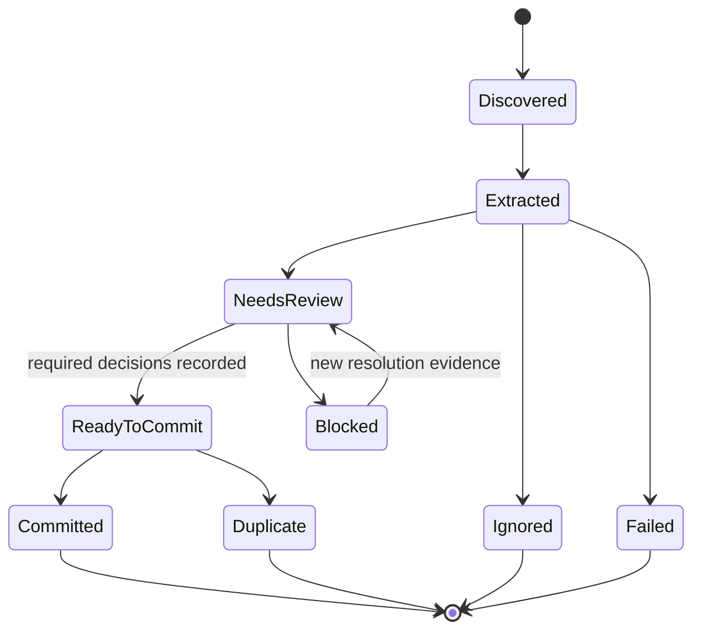
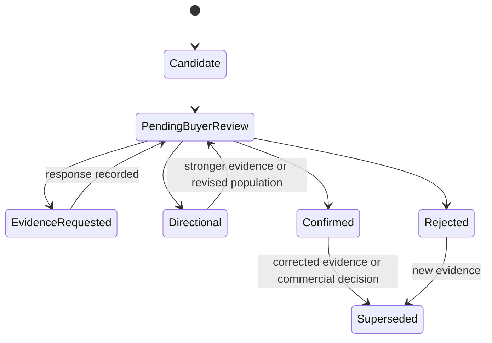

# Forge X platform and process blueprint — September 11, 2026

Status: proposed architecture for review; not an implementation record.

## 1. Platform outcome

Forge X is a portable supplier cost-intelligence platform. It converts supplier documents into immutable evidence, interprets manufacturing and cost meaning under controlled rules, creates basis-safe comparisons, and produces buyer-reviewable actions. It must explain what created a gap, why evidence is comparable, what remains uncertain, and what should happen next.

Portability means the engine can move across companies, commodities, processes, and document formats without mixing private evidence, company policy, or unapproved knowledge.

## 2. System boundaries

| Boundary | Responsibility | Must not do |
|---|---|---|
| External source store | Retains untouched supplier workbooks and other original evidence | Become the live analytical database |
| Company workspace | Holds private supplier evidence, interpretations, scenarios, findings, and audit history | Publish private evidence as shared manufacturing knowledge |
| Central governed registry | Publishes approved identities, units, currencies, roles, and shared definitions | Accept silent local master-data changes |
| Shared manufacturing knowledge | Holds reusable, sourced, scoped, dated, approved process knowledge | Contain supplier quotes, negotiated terms, or company-only policy |
| Economic evidence catalog | Holds sourced market observations with date, geography, specification, and terms | Treat an observation as universally comparable |
| Calculation and comparison plane | Produces deterministic results from pinned evidence and versions | Change immutable evidence or silently choose ambiguous mappings |
| Action and publication plane | Presents findings, captures buyer decisions, freezes outputs, and publishes validated packages | Promote a directional signal into confirmed savings automatically |

## 3. Proposed platform topology

### 3.1 Buyer workstation

The buyer workstation is the single writer for a commodity workspace. It runs the desktop application, local database, extraction workers, calculation workers, renderers, and publication queue. Multiple read-only consumers may use validated snapshots without locking the writer.

### 3.2 Commodity workspace

One persistent commodity database supports multiple sourcing events. Event folders hold source locators, buyer inputs, generated artifacts, and technical manifests; they do not create independent analytical databases. Every event pins the registry generation, rules, evidence cutoff, and scenario revision used.

### 3.3 Central governance plane

A separately governed registry owns commodity, supplier, part, program, buyer-role, unit, currency, and approved relationship definitions. Commodity workspaces consume signed, content-hashed cache generations. Local work can continue only within the approved offline-authority window and cannot mutate central master data.

### 3.4 Shared-knowledge plane

Reusable process, equipment, unit, mapping, and calculation knowledge is physically and logically separate from private company evidence. Knowledge carries provenance, business-valid dates, recorded dates, applicability dimensions, approval level, and conflicts. A knowledge candidate is non-governing until authorized.

### 3.5 Publication plane

Publication starts from a verified local checkpoint, produces a deterministic manifest, and queues an idempotent upload. Remote success requires predecessor validation and remote-hash verification. A newer remote state is never overwritten silently.

## 4. Future module map

These are proposed deep modules for the later engine; they are not current code claims.

| Module | Owns | Interface output |
|---|---|---|
| Source intake | File discovery, role candidates, fingerprints, safe open, adapter selection | Workbook/worksheet inventory and extraction receipt |
| Evidence ledger | Immutable cells, formulas, notes, source context, external availability | Source datum references and reproduction proof |
| Interpretation workbench | Field mappings, identities, units, worksheet roles, process/equipment classifications | Versioned interpretation decisions |
| Manufacturing model | Parts, materials, operations, resources, quantities, time, yield, cost pools | Normalized manufacturing facts with source links |
| Cost graph | Typed inputs/outputs, bases, rules, rounding boundaries, reconciliation | Reproducible relationship graph and calculated outputs |
| Comparability engine | Candidate discovery, dimension alignment, exclusions, weighting, population freeze | Immutable comparison population |
| Analysis engine | Benchmarks, scenarios, APV/NPV, supplier profiles, later statistical models | Versioned results and complete lineage |
| Finding engine | Finding class, impact basis, uncertainty, evidence needs, proposed action | Non-governing suggestion or buyer-reviewable finding |
| Decision workflow | Actions, ownership, supplier response, confirmation, exception, closure | Append-only decision state |
| Presentation | Progressive-disclosure views, exports, deterministic filenames | Frozen artifact contract |
| Integrity and recovery | Health gates, audit chain, checkpoints, restore tests, migration preflight | Readiness decision and recovery evidence |

## 5. End-to-end process map

## 6. Role-classification process

Document role is decided before evidence enters a benchmark population. Worksheet role is independent from worksheet name and may be multi-purpose.

| Document role | Governing use |
|---|---|
| Supplier evidence | Eligible after identity, date, unit, currency, and structure validation |
| Buyer scenario | Scenario input only; never supplier-behavior evidence |
| Market benchmark | Economic comparison only under its source terms and reliability |
| Engineering estimate | Should-cost/model evidence; separate from supplier quotes |
| Generated analysis | Derived context only; never re-ingested as independent market evidence |
| Unresolved | Review required; non-governing |

Worksheet roles include supplier input, supplier calculation, combined input/calculation, supporting interpretation, generated analysis, non-PBD, and unresolved. Cross-sheet dependency edges decide whether a summary-named sheet is required evidence.

## 7. Controlled state maps

### 7.1 Evidence state

### 7.2 Finding state

Finding class and workflow state are separate. `Formula Discrepancy`, `Peer Evidence Difference`, `Modeled Opportunity`, and `Directional Signal` describe evidence meaning. `Confirmed Commercial Saving` requires an explicit supported commercial decision.

## 8. Evidence-to-action explanation contract

Every buyer-facing conclusion must answer, in order:

1. What cost, rate, assumption, or relationship is being challenged?
2. Where exactly did the source evidence come from?
3. What normalized meaning was assigned, by which rule or confirmer?
4. Which population was used, and why was each record included or excluded?
5. What computation produced the result?
6. What is the potential impact and its volume/currency/time basis?
7. What uncertainty or missing evidence remains?
8. What supplier question, negotiation step, sourcing alternative, or data request follows?
9. What evidence would confirm, reject, or reclassify the finding?

## 9. Security, privacy, and portability

- Company workspaces receive distinct database identities, encryption keys, authority evidence, and publication destinations.
- Private supplier evidence never becomes shared knowledge through automatic aggregation.
- Shared knowledge contains no private supplier code, quote, contract, negotiated term, or company-specific approval policy.
- External sources remain read-only and are referenced through fingerprints and locators.
- Every cross-boundary export uses an allowlist, manifest, content hashes, and privacy classification.
- AI may propose mappings, roles, classifications, or questions; deterministic rules or authorized humans govern their use.

## 10. Design decisions still required before coding

| Decision | Why it gates implementation |
|---|---|
| Canonical cost-relationship expression representation | Determines rule authoring, dependency storage, validation, and explainability |
| Initial controlled measure and cost-category catalogs | Prevents incompatible field codes and hidden category drift |
| Process/equipment signature policy | Governs operation comparability and knowledge reuse |
| Document/worksheet role authority matrix | Determines which classifications may be automatic versus confirmed |
| First benchmark population | Establishes a testable comparability contract |
| Finding publication authority | Prevents unsupported automatic claims |
| Company/private/shared deployment isolation | Determines database, cache, package, and key boundaries |
| Approved external market sources | Determines economic-evidence reliability and permitted usage |

The playbook assigns these decisions to explicit review gates before later engine implementation begins.
